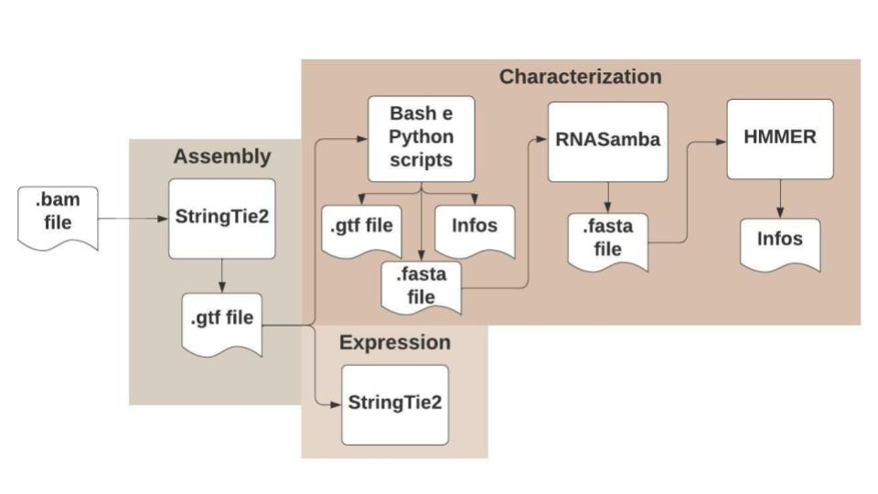

<!--
*** Thanks for checking out the Best-README-Template. If you have a suggestion
*** that would make this better, please fork the repo and create a pull request
*** or simply open an issue with the tag "enhancement".
*** Thanks again! Now go create something AMAZING! :D
-->

<!-- PROJECT SHIELDS -->
<!--
*** I'm using markdown "reference style" links for readability.
*** Reference links are enclosed in brackets [ ] instead of parentheses ( ).
*** See the bottom of this document for the declaration of the reference variables
*** for contributors-url, forks-url, etc. This is an optional, concise syntax you may use.
*** https://www.markdownguide.org/basic-syntax/#reference-style-links
-->

<!-- PROJECT LOGO -->
 

  

  <h3 align="center">Freddie</h3>

  

    Pipeline to identify and quantify chimeric transcripts from coding genes and domain changes
     
    <a href="https://github.com/rmercuri/freddie"><strong>Explore the docs »</strong></a>
     
     
    <a href="https://github.com/rmercuri/freddie">View Demo</a>
    ·
    <a href="https://github.com/rmercuri/freddie/issues">Report Bug</a>
    ·
    <a href="https://github.com/rmercuri/freddie/issues">Request Feature</a>
  

<!-- TABLE OF CONTENTS -->

  
Table of Contents

  <ol>
    <li><a href="#overview">Overview</a></li>
    <li>
      <a href="#installation">Installation</a>
      <ul>
        <li><a href="#dependencies">Dependencies</a></li>
        <li><a href="#installation">Installation</a></li>
      </ul>
    </li>
    <li><a href="#commands-and-options">Commands and options</a></li>
    <li>
      <a href="#running">Running</a>
      <ul>
        <li><a href="#string">StringTie</a></li>
        <li><a href="#chimeric">Chimeric</a></li>
        <li><a href="#coding">Coding</a></li>
        <li><a href="#pfam">Pfam</a></li>
        <li><a href="#expression">Expression</a></li>
        <li><a href="#results">Results</a></li>
      </ul>
    </li>
    <li><a href="#license">License</a></li>
    <li><a href="#contact">Contact</a></li>
    <li><a href="#authors">Authors</a></li>
  </ol>

<!-- OVERVIEW -->
## Overview
Freddie is an easy-to-use pipeline to identify, quantify and determine functionality of chimeric transcripts from RNA-Seq data. The pipepline uses well-established tools to assemble and quantify the transcriptome (StringTie2), predicting whether or not a transcript is coding by machine learning (RNASamba) and altering protein domains by comparison (HMMER and Python3 scripts).

<!-- INSTALLATION -->
## Installation
Freddie can be obtained from Github and installed via through direct installation.

`git clone https://github.com/galantelab/freddie.git`

`cd freddie`

### Dependencies
* Docker
* gffread
* Hammer
* Python3(Biopython)
* R(ggplot2)
* R(reshape2)
* Stringtie2

<!-- COMMANDS AND OPTIONS -->
## Commands and options
Freddie works with a command and subcommands structure:

`freddie [subcommand] <options>`

Subcommands may be invoked by the help menu:

`freddie help`

6 subcommands are avaiable:

Subcommand | Description
------------ | -------------
string | Run StringTie2 to all the samples
chimeric | Finding potential chimeric transcripts
coding | Estimates possibility of a chimeric transcript being coding
pfam | Analyzes the domains of the sequences generated in relation to the host transcript
expression | Measurement of transcript expression
results | Compile results from the previous step

<!-- RUNNING -->
## Running
To run the pipeline you will need STAR-aligned bam (or longSTAR for long reads) and filtered for q 255 reads and their fastq.

### String  
This subcommand uses the Stringtie 2 tool (Kovaka et al., 2019) to assembly the transcriptome of your project or sample. In this step it will process all bams (which should be in input/) individually generating gtfs for each one that will be located in output_str/ and then merge them all into a single annotation file that will be in output/<project>.merge.gtf
  
It is recommended for this step 8 threads.

**Example**

`freddie string -p test -f files.txt -t 8 -e long -g <gtf-path>`

String options are:

Options | Description
------------ | -------------
-p | Project name
-f | Path to the bam files
-t | Threads
-e | Type of reads (short or long)
-g | Path to the reference transcriptome

### Chimeric
Freddie searches through the "chimeric" subcommand for events not yet annotated in the reference transcriptome and that have a 50% overlap with the desired event position (such as Mobile Elements or Retrocopies) or with 50% overlap for both (exon and event), after this identification compares this novels transcripts with the annotated transcripts in the same region and defines which one the most similar transcript and in which region of the new transcript your event was found (Initial, Internal or Final).

The output of this subcommand are divided by 3 files:

- A gtf with the positions of the new transcripts;
[IMG]

- A tsv with the information to insert the events in the transcripts;
[IMG]

- A fasta file with the sequences of the new transcripts.
[IMG]
  
**Example**

`freddie chimeric -p test -i <events-path> -g <gtf-path> -G <genome-path> -y default`

Chimeric options are:

Options | Description
------------ | -------------
-p | Project name
-i | Events input BED4 file
-g | Path to the reference transcriptome
-G | Path to the reference genome
-y | Filter to considered and chimeric event (default [50% overlap of the event in the exon] or strict [50% overlap of the event in the exon and in the exon in the event])

### Coding
Freddie finds the new transcripts that can be encoded through the coding subcommand. In it, the RNASamba tool is used to through machine learning calculates the probability of the transcripts being translated into protein. In this module we considered as potentially translated only those with >= 90% chance of being protein-coding.

The output file is a fasta file with amino acid sequence of potentially coding transcripts.
  
**Example**

`freddie coding -p test -a <absolute-path-to-freddie> -m <name-to-rnasambamodel> -d <path-to-proteinseq>`

Coding options are:

Options | Description
------------ | -------------
-p | Project name
-a | Absolute path where Freddie was installed
-m | File name of the model of RNASamba
-d | Path to the protein sequences

### Pfam
Freddie uses this subcommand to compare the protein domains between the identified chimeric transcripts and the transcripts most similar to this one in the host gene. Through the HMmer tool and individual scripts in Python it is possible to characterize and compare the domains of both transcripts and characterize them between: Loss (total or partial), gain or maintenance of domains.
  
The output file is a tsv file with all domain alterations founded (if it happened) between your set of transcript chimeric amino acid sequence and the host transcript amino acid sequence
  
**Example**
  
`freddie pfam -p test`

Pfam options are:

Options | Description
------------ | -------------
-p | Project name

### Expression
The expression of the chimeric transcripts in the samples is done by StringTie2. In this step, we use the gtf generated by Strigtie as the reference transcriptome. It is one of the most time consuming steps depending on the amount of sample.

The output file is a tsv file which contains a total expression of all the transcripts in all samples. (output/$project_name/expression.tsv)
[IMG]
  
**Example**
  
`freddie expression -p test -f fastq.txt -t 12 -e short`

Expression options are:

Options | Description
------------ | -------------
-p | Project name
-f | Path to the bam files
-t | Threads
-e | Type of reads (short or long)

### Results
Use the results subcommand to summarize all the information found in the previous processes and generate graphs that compare the expression of your group of chimeric transcripts against the expression of the host gene transcript (these graphs are only generated if the chimeric transcript represents more than 15% of the total expression of the host gene).

The output of this subcommand are divided by 2 files:

- A tsv file with summarize all the information about your set of chimeric transcripts;
[IMG]
  
- A boxplot of chimeric transcript represents more than 15% of the total expression of the host gene.
[IMG]

**Example**
  
`freddie results -p test`

Results options are:

Options | Description
------------ | -------------
-p | Project name

<!-- LICENSE -->
## License

<!-- CONTACT -->
## Contact

Rafael Luiz Vieira Mercuri - (rmercuri@mochsl.org.br)

Project Link: [https://github.com/rmercuri/freddie](https://github.com/rmercuri/freddie)

<!-- AUTHORS -->
## Authors
Rafael Luiz Vieira Mercuri

Pedro Alexandre Favoretto Galante

<!-- MARKDOWN LINKS & IMAGES -->
<!-- https://www.markdownguide.org/basic-syntax/#reference-style-links -->
[contributors-shield]: https://img.shields.io/github/contributors/othneildrew/Best-README-Template.svg?style=for-the-badge
[contributors-url]: https://github.com/othneildrew/Best-README-Template/graphs/contributors
[forks-shield]: https://img.shields.io/github/forks/othneildrew/Best-README-Template.svg?style=for-the-badge
[forks-url]: https://github.com/othneildrew/Best-README-Template/network/members
[stars-shield]: https://img.shields.io/github/stars/othneildrew/Best-README-Template.svg?style=for-the-badge
[stars-url]: https://github.com/othneildrew/Best-README-Template/stargazers
[issues-shield]: https://img.shields.io/github/issues/othneildrew/Best-README-Template.svg?style=for-the-badge
[issues-url]: https://github.com/othneildrew/Best-README-Template/issues
[license-shield]: https://img.shields.io/github/license/othneildrew/Best-README-Template.svg?style=for-the-badge
[license-url]: https://github.com/othneildrew/Best-README-Template/blob/master/LICENSE.txt
[linkedin-shield]: https://img.shields.io/badge/-LinkedIn-black.svg?style=for-the-badge&logo=linkedin&colorB=555
[linkedin-url]: https://linkedin.com/in/othneildrew
[product-screenshot]: images/screenshot.png
