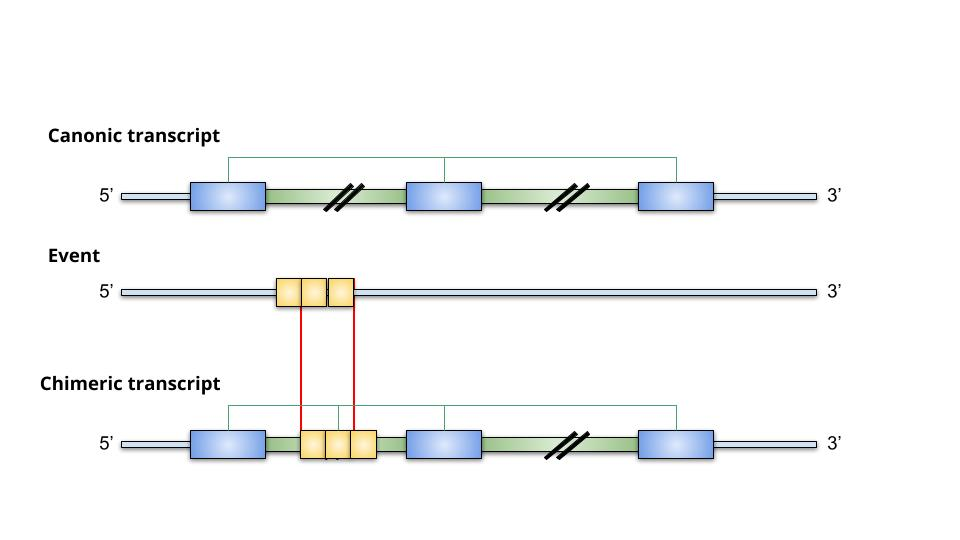

<!--
*** Thanks for checking out the Best-README-Template. If you have a suggestion
*** that would make this better, please fork the repo and create a pull request
*** or simply open an issue with the tag "enhancement".
*** Thanks again! Now go create something AMAZING! :D
-->

<!-- PROJECT SHIELDS -->
<!--
*** I'm using markdown "reference style" links for readability.
*** Reference links are enclosed in brackets [ ] instead of parentheses ( ).
*** See the bottom of this document for the declaration of the reference variables
*** for contributors-url, forks-url, etc. This is an optional, concise syntax you may use.
*** https://www.markdownguide.org/basic-syntax/#reference-style-links
-->

<!-- PROJECT LOGO -->
 

  

  <h3 align="center">Freddie</h3>

  

    Pipeline to identify and quantify chimeric transcripts from coding genes and domain changes
     
    <a href="https://github.com/rmercuri/freddie"><strong>Explore the docs »</strong></a>
     
     
    <a href="https://github.com/rmercuri/freddie">View Demo</a>
    ·
    <a href="https://github.com/rmercuri/freddie/issues">Report Bug</a>
    ·
    <a href="https://github.com/rmercuri/freddie/issues">Request Feature</a>
  

<!-- TABLE OF CONTENTS -->

  
Table of Contents

  <ol>
    <li><a href="#overview">Overview</a></li>
    <li>
      <a href="#installation">Installation</a>
      <ul>
        <li><a href="#dependencies">Dependencies</a></li>
        <li><a href="#installation">Installation</a></li>
      </ul>
    </li>
    <li><a href="#commands-and-options">Commands and options</a></li>
    <li>
      <a href="#running">Running</a>
      <ul>
        <li><a href="#string">StringTie</a></li>
        <li><a href="#chimeric">Chimeric</a></li>
        <li><a href="#coding">Coding</a></li>
        <li><a href="#pfam">Pfam</a></li>
        <li><a href="#expression">Expression</a></li>
        <li><a href="#results">Results</a></li>
      </ul>
    </li>
    <li><a href="#license">License</a></li>
    <li><a href="#contact">Contact</a></li>
    <li><a href="#authors">Authors</a></li>
  </ol>

<!-- OVERVIEW -->
## Overview
Freddie is a user-friendly pipeline designed to identify, quantify, and analyze chimeric transcripts from RNA-Seq data. The pipeline utilizes well-established tools such as StringTie2 for transcriptome assembly and quantification. In addition, machine learning algorithms provided by RNASamba are used to predict whether a transcript is coding. To further enhance the analysis, Freddie also incorporates HMMER and Python3 scripts to compare protein domains and identify potential alterations. With these tools, Freddie provides a comprehensive approach to chimeric transcript analysis that is both efficient and effective.

<!-- INSTALLATION -->
## Installation
Freddie can be obtained from Dockerfile.

`docker pull galantelab/freddie:latest`

<!-- COMMANDS AND OPTIONS -->
## Commands and options
Freddie works with a command and subcommands structure:

`freddie [subcommand] <options>`

Subcommands may be invoked by the help menu:

`freddie help`

6 subcommands are avaiable:

Subcommand | Description
------------ | -------------
string | Run StringTie2 to all the samples
chimeric | Finding potential chimeric transcripts
coding | Estimates possibility of a chimeric transcript being coding
pfam | Analyzes the domains of the sequences generated in relation to the host transcript
expression | Measurement of transcript expression
results | Compile results from the previous step

<!-- RUNNING -->
## Running
To run the pipeline you will need STAR-aligned bam (or longSTAR for long reads) and filtered for q255 reads and their fastq. To execute this filter in the bam file you must use this command:

`samtools view -h -b -q 255 <bam-file> -o <output-name>`

### String  
The transcriptome of your project or sample can be assembled using the StringTie 2 tool (Kovaka et al., 2019) through the use of a specific subcommand. During this process, the tool will independently process each bam file, creating individual gtfs for each one. These gtfs will be stored in the output_str/ directory. Following this, the generated gtfs will be merged into a single annotation file that will be located in the output/ directory and named $project.merge.gtf. This final annotation file will contain the comprehensive transcriptome assembly for your project or sample.

It is recommended for this step 8 threads.

**Example**

`docker run --rm -u $(id -u):$(id -g) -w $(pwd) -v <reference-files>:/home/ref/ -v <input-path>:/home/input/ -v <output-path>:/home/output/ galantelab/freddie:latest \
	string -p test -f /home/input/<bam-files.txt> -t 8 -e long -g /home/ref/<gtf-path>`

String options are:

Options | Description
------------ | -------------
-p | Project name
-f | List of bam files in input path
-t | Threads
-e | Type of reads (short or long)
-g | Path to the reference transcriptome

### Chimeric
Within the "chimeric" subcommand, Freddie conducts a search for events that have not been previously annotated in the reference transcriptome and possess a 50% overlap with the desired event position. This can include events such as Mobile Elements or Retrocopies. Additionally, Freddie also searches for events that possess a 50% overlap with both the event and the exon. Following the identification of these novel transcripts, they are compared to the annotated transcripts within the same region. This allows Freddie to determine which transcript is the most similar and in which region of the novel transcript the event was found. Specifically, the location of the event within the novel transcript is identified as either initial, internal, or final, depending on its position within the transcript. This thorough approach allows for the comprehensive analysis of chimeric events and enhances the accuracy of the results.

The output of this subcommand are divided by 3 files:

- A gtf with the positions of the new transcripts;

- A tsv with the information to insert the events in the transcripts;

- A fasta file with the sequences of the new transcripts.
  
**Example**

`docker run --rm -u $(id -u):$(id -g) -w $(pwd) -v <reference-files>:/home/ref/ -v <input-path>:/home/input/ -v <output-path>:/home/output/ galantelab/freddie:latest \
	chimeric -p test -i /home/input/<events-file> -g /home/ref/<gtf-path> -G /home/ref/<genome-path> -y default`

Chimeric options are:

Options | Description
------------ | -------------
-p | Project name
-i | Events input BED4 file
-g | Path to the reference transcriptome
-G | Path to the reference genome
-y | Filter to considered and chimeric event (default [50% overlap of the event in the exon] or strict [50% overlap of the event in the exon and in the exon in the event])

### Coding
Freddie finds the new transcripts that can be encoded through the coding subcommand. The RNASamba tool is utilized to employ machine learning algorithms in order to calculate the probability of each transcript being translated into protein. In this module, we only consider transcripts with a probability of 90% or higher as potentially protein-coding.

The output file is a fasta file with amino acid sequence of potentially coding transcripts.
  
**Example**

`docker run --rm -u $(id -u):$(id -g) -w $(pwd) -v <reference-files>:/home/ref/ -v <input-path>:/home/input/ -v <output-path>:/home/output/ galantelab/freddie:latest \
	coding -p test -m /home/ref/<rnasambamodel> -d /home/ref/<proteinseq-file>`

Coding options are:

Options | Description
------------ | -------------
-p | Project name
-m | File name of the model of RNASamba
-d | Path to the protein sequences

### Pfam
To compare the protein domains of chimeric transcripts and their closest counterparts in the host gene, Freddie employs the coding subcommand. Using the HMmer tool along with individual Python scripts, the domains of both transcripts can be characterized and compared. The domains can be classified as lost (either partially or entirely), gained, or maintained between the two transcripts.
  
The output file is a tsv file with all domain alterations founded (if it happened) between your set of transcript chimeric amino acid sequence and the host transcript amino acid sequence
  
**Example**
  
`docker run --rm -u $(id -u):$(id -g) -w $(pwd) -v <reference-files>:/home/ref/ -v <input-path>:/home/input/ -v <output-path>:/home/output/ galantelab/freddie:latest \
	pfam -p test`

Pfam options are:

Options | Description
------------ | -------------
-p | Project name

### Expression
The expression of the chimeric transcripts in the samples is done by StringTie2. In this step, we use the gtf generated by Strigtie as the reference transcriptome. It is one of the most time consuming steps depending on the amount of sample.

The output file is a tsv file which contains a total expression of all the transcripts in all samples. (output/$project_name/expression.tsv)
  
**Example**
 
`docker run --rm -u $(id -u):$(id -g) -w $(pwd) -v <reference-files>:/home/ref/ -v <input-path>:/home/input/ -v <output-path>:/home/output/ galantelab/freddie:latest \
	expression -p test -f /home/input/<bam-files.txt> -t 12 -e short`

Expression options are:

Options | Description
------------ | -------------
-p | Project name
-f | List of bam files in input path
-t | Threads
-e | Type of reads (short or long)

### Results
Use the results subcommand to summarize all the information found in the previous processes and generate graphs that compare the expression of your group of chimeric transcripts against the expression of the host gene transcript (these graphs are only generated if the chimeric transcript represents more than 15% of the total expression of the host gene).

The output of this subcommand are divided by 2 files:

- A tsv file with summarize all the information about your set of chimeric transcripts;
  
- A boxplot of chimeric transcript represents more than 15% of the total expression of the host gene.

**Example**
  
`docker run --rm -u $(id -u):$(id -g) -w $(pwd) -v <reference-files>:/home/ref/ -v <input-path>:/home/input/ -v <output-path>:/home/output/ galantelab/freddie:latest \
	results -p test`

Results options are:

Options | Description
------------ | -------------
-p | Project name

<!-- LICENSE -->
## License

<!-- CONTACT -->
## Contact

Rafael Luiz Vieira Mercuri - (rmercuri@mochsl.org.br)

Project Link: [https://github.com/rmercuri/freddie](https://github.com/rmercuri/freddie)

<!-- AUTHORS -->
## Authors
Rafael Luiz Vieira Mercuri

Pedro Alexandre Favoretto Galante

<!-- MARKDOWN LINKS & IMAGES -->
<!-- https://www.markdownguide.org/basic-syntax/#reference-style-links -->
[contributors-shield]: https://img.shields.io/github/contributors/othneildrew/Best-README-Template.svg?style=for-the-badge
[contributors-url]: https://github.com/othneildrew/Best-README-Template/graphs/contributors
[forks-shield]: https://img.shields.io/github/forks/othneildrew/Best-README-Template.svg?style=for-the-badge
[forks-url]: https://github.com/othneildrew/Best-README-Template/network/members
[stars-shield]: https://img.shields.io/github/stars/othneildrew/Best-README-Template.svg?style=for-the-badge
[stars-url]: https://github.com/othneildrew/Best-README-Template/stargazers
[issues-shield]: https://img.shields.io/github/issues/othneildrew/Best-README-Template.svg?style=for-the-badge
[issues-url]: https://github.com/othneildrew/Best-README-Template/issues
[license-shield]: https://img.shields.io/github/license/othneildrew/Best-README-Template.svg?style=for-the-badge
[license-url]: https://github.com/othneildrew/Best-README-Template/blob/master/LICENSE.txt
[linkedin-shield]: https://img.shields.io/badge/-LinkedIn-black.svg?style=for-the-badge&logo=linkedin&colorB=555
[linkedin-url]: https://linkedin.com/in/othneildrew
[product-screenshot]: images/screenshot.png
