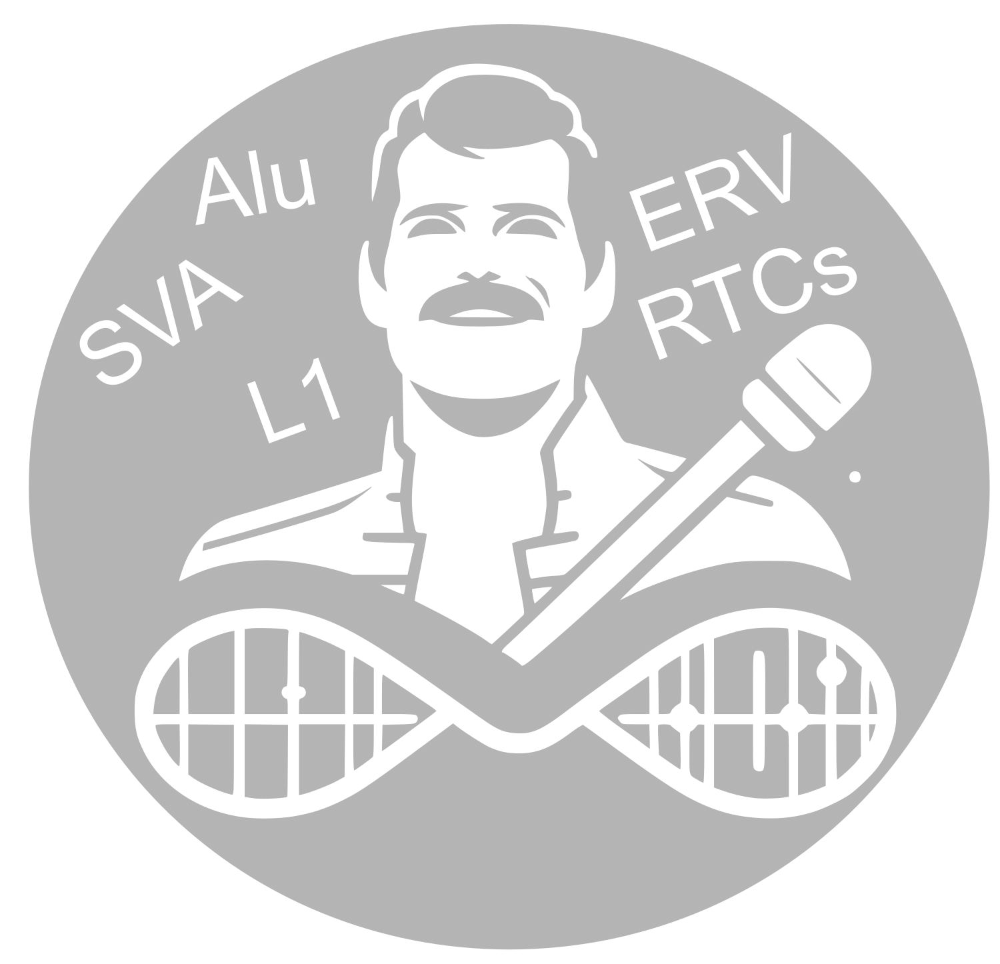

<!--
*** Thanks for checking out the Best-README-Template. If you have a suggestion
*** that would make this better, please fork the repo and create a pull request
*** or simply open an issue with the tag "enhancement".
*** Thanks again! Now go create something AMAZING! :D
-->


<!-- PROJECT SHIELDS -->
<!--
*** I'm using markdown "reference style" links for readability.
*** Reference links are enclosed in brackets [ ] instead of parentheses ( ).
*** See the bottom of this document for the declaration of the reference variables
*** for contributors-url, forks-url, etc. This is an optional, concise syntax you may use.
*** https://www.markdownguide.org/basic-syntax/#reference-style-links
-->

<!-- PROJECT LOGO -->
<br />
<p align="center">
  <a href="https://github.com/rmercuri/freddie">
    
  </a>

  <h2 align="center">Freddie</h2>

  <p align="center">
    A tool to identify exonization of retrotransposable elements using RNA-seq data. 
    <br />
    <a href="https://github.com/rmercuri/freddie/issues">Report Bug</a>
  </p>
</p>


<!-- TABLE OF CONTENTS -->
<details open="open">
  <summary><h3>Table of Contents</h3></summary>
  <ol>
    <li><a href="#overview">Overview</a></li>
    <li>
      <a href="#installation">Installation</a>
      <ul>
        <li><a href="#installation">Docker installation</a></li>
        <li><a href="#databases">Databases</a></li>
      </ul>
    </li>
    <li><a href="#usage">Usage</a></li>
    <li>
      <a href="#commands-and-options">Commands and options</a>
      <ul>
        <li><a href="#star">Star</a></li>
        <li><a href="#string">StringTie</a></li>
        <li><a href="#chimeric">Chimeric</a></li>
        <li><a href="#coding">Coding</a></li>
        <li><a href="#pfam">Pfam</a></li>
        <li><a href="#expression">Expression</a></li>
        <li><a href="#results">Results</a></li>
      </ul>
    </li>
    <li><a href="#practical-workflow">Practical Workflow</a></li>
    <li><a href="#contact">Contact</a></li>
    <li><a href="#authors">Authors</a></li>
  </ol>
</details>

<!-- OVERVIEW -->
### Overview
<p align="justify"> Freddie is a user-friendly pipeline designed to identify, quantify, and analyze chimeric transcripts from RNA-Seq data. The pipeline utilizes well-established tools such as StringTie2 for transcriptome assembly and quantification. In addition, machine learning algorithms provided by RNASamba are used to predict whether a transcript is coding. To further enhance the analysis, Freddie also incorporates HMMER and Python3 scripts to compare protein domains and identify potential alterations. With these tools, Freddie provides a comprehensive approach to chimeric transcript analysis that is both efficient and effective. </p>

<a href="https://github.com/rmercuri/freddie">
    
</a>

<!-- INSTALLATION -->
### Installation
The source code for FREDDIE can be obtained in our github page using the following command:

```bash
git clone https://github.com/galantelab/freddie.git
```

Inside FREDDIE’s directory, build a docker image:

```bash
cd freddie
sudo docker build -f Dockerfile -t freddie .
```

### Databases
We provide all the necessary databases to run FREDDIE, catering to human functionality. In our comprehensive documentation available in the supplementary material, we offer a step-by-step guide to generating these exact files for other species.


File | Description
------------ | -------------
<a href="https://bioinfohsl-tools.s3.amazonaws.com/freddie/databases/star_index.tar.gz">star_index</a> | Folder with STAR Index built with hg38.fa and gencode v36
<a href="https://bioinfohsl-tools.s3.amazonaws.com/freddie/databases/gencode.v36.annotation.gtf">gencode.v36.annotation.gtf</a> | GTF file (Used in TCGA)
<a href="https://bioinfohsl-tools.s3.amazonaws.com/freddie/databases/hg38.fa">hg38.fa</a> | Reference Genome
<a href="https://bioinfohsl-tools.s3.amazonaws.com/freddie/databases/hg38.fa.fai">hg38.fa.fai</a> | Index of reference genome
<a href="https://bioinfohsl-tools.s3.amazonaws.com/freddie/databases/hg38.pep.fa">hg38.pep.fa</a> | Aminoacid sequences of proteins
<a href="https://bioinfohsl-tools.s3.amazonaws.com/freddie/databases/human38_model.hdf5">model.hdf5</a> | RNASamba model (Works for mammals in general)
<a href="https://bioinfohsl-tools.s3.amazonaws.com/freddie/databases/Pfam-A.hmm">Pfam-A.hmm</a> | HMMER model (Works to mammals in general) you need to download all files with .hmm
<a href="https://bioinfohsl-tools.s3.amazonaws.com/freddie/databases/Pfam-A.hmm.h3f">Pfam-A.hmm.h3f</a> | HMMER model
<a href="https://bioinfohsl-tools.s3.amazonaws.com/freddie/databases/Pfam-A.hmm.h3i">Pfam-A.hmm.h3i</a> | HMMER model
<a href="https://bioinfohsl-tools.s3.amazonaws.com/freddie/databases/Pfam-A.hmm.h3m">Pfam-A.hmm.h3m</a> | HMMER model
<a href="https://bioinfohsl-tools.s3.amazonaws.com/freddie/databases/Pfam-A.hmm.h3p">Pfam-A.hmm.h3p</a> | HMMER model

To use `star_index.tar.gz` you should uncompress the folder:


```bash
tar -xvf star_index.tar.gz
```

<!-- USAGE -->
## Usage
FREDDIE has seven subcommands: “star”, “string”, “chimeric”, “coding”, “pfam”, “expression” and “results”.

`freddie [subcommand] <options>`

Subcommands may be invoked by the help menu:

```bash
freddie help
```

Subcommand | Description
------------ | -------------
star | Aligns RNA-seq data against the genome using STAR (DOI: 10.1093/bioinformatics/bts635)
string | Assembles sequenced reads (compatible with both short and long reads) using StringTie2 (DOI: 10.1186/s13059-019-1910-1)
chimeric | Identifies potential chimeric transcripts
coding | Computes the coding potential of (chimeric) transcripts using RNASamba (DOI: https://doi.org/10.1093/nargab/lqz024)
pfam | Searches for protein domains using HMMer (DOI: 10.1093/nar/gkr367) and PFAM protein families and domains (https://doi.org/10.1093/nar/gkaa913)
expression | Estimates transcript expression using StringTie2 (DOI: 10.1186/s13059-019-1910-1)
results | Compiles the final results of chimeric transcripts incorporating inputs from previous steps

<!-- COMMANDS AND OPTIONS -->
## Commands and options
### Star
The first step in the FREDDIE’s pipeline is the “star”. The inputs to this command are FASTQ files and a STAR index (pre-made available <a href="https://bioinfohsl-tools.s3.amazonaws.com/freddie/databases/star_index.tar.gz">here</a>). The output is a sorted and filtered BAM aligned file, which will become the input to the next step. This command supports all types of RNA-Seq data (paired-end, single-end and long-reads), either compressed (as .gz) or not.

OPTIONS:

Short | Long | Description
------------ | ------------- | -------------
-o | --output-dir | Output directory. Creates the directory if it does not exist [MANDATORY]
-i | --index-dir | STAR index directory [MANDATORY]
-f | --file | File containing a newline separated list of sequencing files in FASTQ format. This option is not mandatory if one or more FASTQ files are passed as argument [MANDATORY]
-h | --help | Prints help message
-t | --threads | Number of threads [default: 8]
-S | --short-reads | Set the sequencing to short reads [default]
-L | --long-reads | Set the sequencing to long reads
-s | --single-end | For short reads '-S', set the type of sequencing to single-end
-p | --paired-end | For short reads '-S', set the type of sequencing to paired-end. In this case, the FASTQ files will be processed, being considered forward (R1) and reverse complement (R2) according to the order in which they are passed [default]

**Example**

```bash
docker run --rm -u $(id -u):$(id -g) -w $(pwd) -v <star_index-path>:/home/freddie/star_index/ -v <fastq-path>:/home/freddie/input/ -v <output-path>:/home/freddie/output/ freddie star -o test -i /home/freddie/star_index/ -f /home/freddie/input/<fastq-path>
```

Where:

`<star_index-path>` is the directory where star_index was downloaded. Ex.: `$PWD/star_index/`

`<fastq-file-path>` is the directory where all FASTQ files are. Ex.: if `$PWD/*.fastq.gz` type `$PWD/`

`<output-path>` is the output directory. Ex.: `$PWD/output/`

`<fastq-path>` is a .txt file inside `/home/freddie/input/` with the docker path (for instance `/home/freddie/input/test.fastq.gz`) to the FASTQ files.

### String
The next step in the pipeline is “string”. This subcommand performs a transcriptome assembly with the BAMs generated in the previous step (or custom BAMs provided by the user). The output of this analysis is a GTF file representing the transcriptome from all samples.

OPTIONS:

Short | Long | Description
------------ | ------------- | -------------
-o | --output-dir | Output directory. Creates the directory if it does not exist [MANDATORY]
-a | --annotation | Gene annotation of the reference transcriptome in GTF format [MANDATORY]
-f | --file | File containing a newline separated list of sequencing files in FASTQ format. This option is not mandatory if one or more FASTQ files are passed as argument [MANDATORY]
-h | --help | Prints help message
-t | --threads | Number of threads [default: 8]
-S | --short-reads | Set the sequencing to short reads [default]
-L | --long-reads | Set the sequencing to long reads

**Example**

```bash
docker run --rm -u $(id -u):$(id -g) -w $(pwd) -v <gtf-file-path>:/home/freddie/gtf/ -v <output-path>:/home/freddie/output/ freddie string -o test -a /home/freddie/gtf/<gtf-file>`
```

Where:

`<gtf-file-path>` is the directory where gtf was downloaded. Ex.: if `$PWD/gencodev36.annotation.gtf` type `$PWD/`

`<output-path>` is the output directory. Ex.: `$PWD/output/`

`<gtf-file>` is a GTF inside /home/freddie/gtf/. Ex.: `/home/freddie/gtf/gencodev36.annotation.gtf`

### Chimeric
In the “chimeric” step, the pipeline identifies novel transcripts based on the GTF file generated from the “string” subcommand. Here, FREDDIE uses a list of events provided by the user to find transcripts containing overlaps between exons and the given events. Again, a GTF file and also a FASTA file with all transcripts found are the outputs provided.

<a href="https://github.com/rmercuri/freddie">
    
</a>


OPTIONS:

Short | Long | Description
------------ | ------------- | -------------
-o | --output-dir | Output directory. Creates the directory if it does not exist [MANDATORY]
-a | --annotation | Gene annotation of the reference transcriptome in GTF format [MANDATORY]
-g | --genome | FASTA file of the reference genome, which is the same one file used for reads alignment using STAR [MANDATORY]
-e | --stringtie-out | StringTie2 output events file in BED4 [MANDATORY]
-h | --help | Prints help message
-T | --tmp-dir | Custom directory for temporary files [default: /tmp]
-r | --reciprocal | Criteria for identification of chimeric events is at least 50% overlap of the event with the exon and at least 50% overlap of the exon with the event
-R | --irreciprocal | Criteria for identification of chimeric events is at least 50% overlap of the event with the exon [default]

**Example**

```bash
docker run --rm -u $(id -u):$(id -g) -w $(pwd) -v <gtf-file-path>:/home/freddie/gtf/ -v <genome-file-path>:/home/freddie/ref_fa/ -v <events-file-path>:/home/freddie/events/ -v <output-path>:/home/freddie/output/ freddie chimeric -o test -g /home/freddie/gtf/<gtf-file> -G /home/freddie/ref_fa/<genome-file> -i /home/freddie/events/<event-file>
```

Where:

`<gtf-file-path>` is the directory where GTF file was downloaded. Ex.: if `$PWD/gencodev36.annotation.gtf` type `$PWD/`

`<genome-file-path>` is the directory where the reference genome and reference genome index were downloaded. Ex.: if `$PWD/hg38.fa` type `$PWD/`

`<events-file-path>` is the directory where the events are. Ex.: if `$PWD/events.bed` type `$PWD/`

`<output-path>` is the output directory. Ex.: `$PWD/output/`

`<gtf-file>` is a GTF file inside `/home/freddie/gtf/`. Ex.: `/home/freddie/gtf/gencodev36.annotation.gtf`

`<genome-file>` is a .fa inside `/home/freddie/ref_fa/`. Ex.: `/home/freddie/ref_fa/hg38.fa`

`<events-file>` is a .bed inside `/home/freddie/events/`. Ex.: `/home/freddie/events/events.bed`

### Coding
The “coding” subcommand classifies the novel transcripts identified in the “chimeric” step as coding or non-coding. Here, FREDDIE uses a model trained by RNASamba (available at <a href="https://bioinfohsl-tools.s3.amazonaws.com/freddie/databases/human38_model.hdf5">here</a>) to calculate the probability of a transcript being coding. In the end, a FASTA file with the protein sequences of all coding transcripts considered by our criteria is created.

OPTIONS:

Short | Long | Description
------------ | ------------- | -------------
-o | --output-dir | Output directory. Creates the directory if it does not exist [MANDATORY]
-m | --protein-model | File with the RNASamba model [MANDATORY]
-d | --protein-db | File with the protein sequences [MANDATORY]
-h | --help | Prints help message
-P | --probability | Cutoff to consider transcripts protein-coding, based on the probability provided by RNASamba [default: 0.9]

**Example**

```bash
docker run --rm -u $(id -u):$(id -g) -w $(pwd) -v <rnasambamodel-file-path>:/home/freddie/rnasamba/ -v <proteinseq-file-path>:/home/freddie/proteinseq/ -v <output-path>:/home/freddie/output/ freddie coding -o test -m /home/freddie/rnasamba/<rnasambamodel-file> -d /home/freddie/proteinseq/<proteinseq-file>
```

Where:

`<rnasambamodel-file-path>` is the directory where RNASamba model was downloaded. Ex.: if `$PWD/model.hdf5` type `$PWD/`

`<proteinseq-file-path>` is the directory where the protein sequences file was downloaded. Ex.: if `$PWD/hg38.pep.fa` type `$PWD/`

`<output-path>` is the output directory. Ex.: `$PWD/output/`

`<rnasambamodel-file>` is a .hdf5 inside `/home/freddie/rnasamba/`. Ex.: `/home/freddie/rnasamba/model.hdf5`

`<proteinseq-file>` is a .fa inside `/home/freddie/proteinseq/`. Ex.: `/home/freddie/proteinseq/hg38.pep.fa`

### Pfam
The “pfam” step searches for protein domains in the novel transcripts that passed the user’s predefined coding probability and subsequently compares them with the host’s protein domains. In order to identify them, we use HMMER trained with the PFAM database. The output of this subcommand is a TSV file comparing the protein domains of the novel transcripts identified with those of the host genes.

OPTIONS:

Short | Long | Description
------------ | ------------- | -------------
-o | --output-dir | Output directory. Creates the directory if it does not exist [MANDATORY]
-M | --pfam-model | A database of protein domain families to be used as an index for HMMER [MANDATORY]
-h | --help | Prints help message
-T | --tmp-dir | Custom directory for temporary files [default: /tmp]
-t | --threads | Number of threads [default: 4]
-E | --e-value | In the HMMER per-target output, reports target sequences with an e-value lesser than NUM [default: 1e-6]

**Example**
  
```bash
docker run --rm -u $(id -u):$(id -g) -w $(pwd) -v <pfammodel-file-path>:/home/freddie/pfammodel/ -v <output-path>:/home/freddie/output/ freddie pfam -o test -M <pfammodel-file>
```

Where:

`<pfammodel-file-path>` is the directory where PFAM model was downloaded. Ex.: if `$PWD/Pfam-A.hmm` type `$PWD/`

`<output-path>` is the output directory. Ex.: `$PWD/output/`

`<pfammodel-file>` is a .hmm inside `/home/freddie/pfammodel/`. Ex.: `/home/freddie/pfammodel/Pfam-A.hmm`

### Expression
The FREDDIE's “expression” subcommand quantifies all the transcriptomes assembled by the StringTie2's “expression” function. The expression results, in TPM (transcript per million) per transcript per sample, are made available as a TSV file.

OPTIONS:

Short | Long | Description
------------ | ------------- | -------------
-o | --output-dir | Output directory. Creates the directory if it does not exist [MANDATORY]
-f | --file | File containing a newline separated list of sequencing files in FASTQ format. This option is not mandatory if one or more FASTQ files are passed as argument
-h | --help | Prints help message
-T | --tmp-dir | Custom directory for temporary files [default: /tmp]
-t | --threads | Number of threads [default: 8]
-S | --short-reads | Set the sequencing to short reads [default]
-L | --long-reads | Set the sequencing to long reads

**Example**
 
```bash
docker run --rm -u $(id -u):$(id -g) -w $(pwd) -v <output-path>:/home/freddie/output/ freddie expression -o test
```

Where:

`<output-path>` is the output directory. Ex.: `$PWD/output/`

### Results
Finally, the “results” subcommand compiles all relevant information from the previous steps. Moreover, if the novel transcripts contribute to the expression of their respective host genes, this step further generates boxplots to show the relative contribution of such expression patterns.

OPTIONS:

Short | Long | Description
------------ | ------------- | -------------
-o | --output-dir | Output directory. Creates the directory if it does not exist [MANDATORY]
-h | --help | Prints help message
-T | --tmp-dir | Custom directory for temporary files [default: /tmp]

**Example**
  
```bash
docker run --rm -u $(id -u):$(id -g) -w $(pwd) -v <output-path>:/home/freddie/output/ freddie results -o test
```

Where:

`<output-path>` is the output directory. Ex.: `$PWD/output/`

<!-- PRACTICAL -->
## Practical workflow
In order to execute FREDDIE, we selected RNA-seq paired-end data of 2 samples related to the cell line K562 from the <a href="https://www.encodeproject.org/">ENCODE Project</a>.

First, you should download the data:

```bash
mkdir fastq

cd fastq/

##ENCLB063ZZZ R1
wget https://www.encodeproject.org/files/ENCFF001RWF/@@download/ENCFF001RWF.fastq.gz
mv ENCFF001RWF.fastq.gz ENCLB063ZZZ_R1.fastq.gz

##ENCLB063ZZZ R2
wget https://www.encodeproject.org/files/ENCFF001RWC/@@download/ENCFF001RWC.fastq.gz
mv ENCFF001RWC.fastq.gz ENCLB063ZZZ_R2.fastq.gz

##ENCLB059ZZZ R1
wget https://www.encodeproject.org/files/ENCFF001RDE/@@download/ENCFF001RDE.fastq.gz
mv ENCFF001RDE.fastq.gz ENCLB059ZZZ_R1.fastq.gz

##ENCLB059ZZZ R2
wget https://www.encodeproject.org/files/ENCFF001RCW/@@download/ENCFF001RCW.fastq.gz
mv ENCFF001RCW.fastq.gz ENCLB059ZZZ_R2.fastq.gz

cd ..
```

And download the databases of FREDDIE:

```bash
mkdir db
cd db/

## STAR Index (Based on Human hg38 - Gencode v36)
wget https://bioinfohsl-tools.s3.amazonaws.com/freddie/databases/star_index.tar.gz
tar -xvf star_index.tar.gz

## Gencode v36 as the human annotation
wget https://bioinfohsl-tools.s3.amazonaws.com/freddie/databases/gencode.v36.annotation.gtf

## hg38 as the human reference genome
wget https://bioinfohsl-tools.s3.amazonaws.com/freddie/databases/hg38.fa

## Aminoacid sequence
wget https://bioinfohsl-tools.s3.amazonaws.com/freddie/databases/hg38.pep.fa

## RNASamba model
wget https://bioinfohsl-tools.s3.amazonaws.com/freddie/databases/human38_model.hdf5

## HMMer model
wget https://bioinfohsl-tools.s3.amazonaws.com/freddie/databases/Pfam-A.hmm
wget https://bioinfohsl-tools.s3.amazonaws.com/freddie/databases/Pfam-A.hmm.h3f
wget https://bioinfohsl-tools.s3.amazonaws.com/freddie/databases/Pfam-A.hmm.h3i
wget https://bioinfohsl-tools.s3.amazonaws.com/freddie/databases/Pfam-A.hmm.h3m
wget https://bioinfohsl-tools.s3.amazonaws.com/freddie/databases/Pfam-A.hmm.h3p

## Retrocopies events
wget https://bioinfohsl-tools.s3.amazonaws.com/rcpedia/downloads/beds/RCP_9606.bed
cut -f 1,2,3,5 RCP_9606.bed | sort -k1,1 -k2,2n > RCP_9606.bed4

cd ..
```

Then, prepare a file with the FASTQ PATHs:

```bash
ls fastq/*fastq.gz | awk '{print "/home/freddie/"$1}' > files.txt
```

After that, install and build a docker image:

```bash
git clone https://github.com/galantelab/freddie.git
cd freddie
sudo docker build -f Dockerfile -t freddie .
cd ..
```

Finally, you will be able to execute FREDDIE as follows:

- “star” step:

```bash
time docker run --rm -u $(id -u):$(id -g) -w $(pwd) -v $PWD:/home/freddie freddie star -o /home/freddie/K562 -i /home/freddie/db/star_index -f /home/freddie/files.txt
```

- “string” step:

```bash
time docker run --rm -u $(id -u):$(id -g) -w $(pwd) -v $PWD:/home/freddie freddie string -o /home/freddie/K562 -a /home/freddie/db/gencode.v36.annotation.gtf
```

- “chimeric” step:

```bash
time docker run --rm -u $(id -u):$(id -g) -w $(pwd) -v $PWD:/home/freddie freddie chimeric -o /home/freddie/K562 -a /home/freddie/db/gencode.v36.annotation.gtf -g /home/freddie/db/hg38.fa -e /home/freddie/db/RCP_9606.bed4
```

- “coding” step:

```bash
time docker run --rm -u $(id -u):$(id -g) -w $(pwd) -v $PWD:/home/freddie freddie coding -o /home/freddie/K562 -m /home/freddie/db/human38_model.hdf5 -d /home/freddie/db/hg38.pep.fa
```

- “pfam” step:

```bash
time docker run --rm -u $(id -u):$(id -g) -w $(pwd) -v $PWD:/home/freddie freddie pfam -o /home/freddie/K562 -M /home/freddie/db/Pfam-A.hmm
```

- “expression” step:

```bash
time docker run --rm -u $(id -u):$(id -g) -w $(pwd) -v $PWD:/home/freddie freddie expression -o /home/freddie/K562
```

- “results” step:

```bash
time docker run --rm -u $(id -u):$(id -g) -w $(pwd) -v $PWD:/home/freddie freddie results -o /home/freddie/K562
```

All information related to the chimeric transcripts identified by FREDDIE are available in the final output named “results.tsv”. If you wish to inspect these transcripts in a Genome Browser such as at <a href="https://genome.ucsc.edu/cgi-bin/hgGateway">UCSC</a> you can easily upload the “K562/chimeric/chimeric.gtf” file, also provided by the FREDDIE’s pipeline, to the “custom tracks”.

<!-- CONTACT -->
## Contact

Rafael Luiz Vieira Mercuri - (rmercuri@mochsl.org.br)

Thiago Luiz Araújo Miller - (tmiller@mochsl.org.br)

Pedro Alexandre Favoretto Galante - (pgalante@mochsl.org.br)

Project Link: [https://github.com/galantelab/freddie](https://github.com/galantelab/freddie)

<!-- AUTHORS -->
## Authors
Rafael Luiz Vieira Mercuri

Thiago Luiz Araújo Miller

Filipe Ferreira dos Santos

Matheus de Lima

Aline Rangel-Pozzo

Pedro Alexandre Favoretto Galante

<!-- MARKDOWN LINKS & IMAGES -->
<!-- https://www.markdownguide.org/basic-syntax/#reference-style-links -->
[contributors-shield]: https://img.shields.io/github/contributors/othneildrew/Best-README-Template.svg?style=for-the-badge
[contributors-url]: https://github.com/othneildrew/Best-README-Template/graphs/contributors
[forks-shield]: https://img.shields.io/github/forks/othneildrew/Best-README-Template.svg?style=for-the-badge
[forks-url]: https://github.com/othneildrew/Best-README-Template/network/members
[stars-shield]: https://img.shields.io/github/stars/othneildrew/Best-README-Template.svg?style=for-the-badge
[stars-url]: https://github.com/othneildrew/Best-README-Template/stargazers
[issues-shield]: https://img.shields.io/github/issues/othneildrew/Best-README-Template.svg?style=for-the-badge
[issues-url]: https://github.com/othneildrew/Best-README-Template/issues
[license-shield]: https://img.shields.io/github/license/othneildrew/Best-README-Template.svg?style=for-the-badge
[license-url]: https://github.com/othneildrew/Best-README-Template/blob/master/LICENSE.txt
[linkedin-shield]: https://img.shields.io/badge/-LinkedIn-black.svg?style=for-the-badge&logo=linkedin&colorB=555
[linkedin-url]: https://linkedin.com/in/othneildrew
[product-screenshot]: assets/img/screenshot.png
